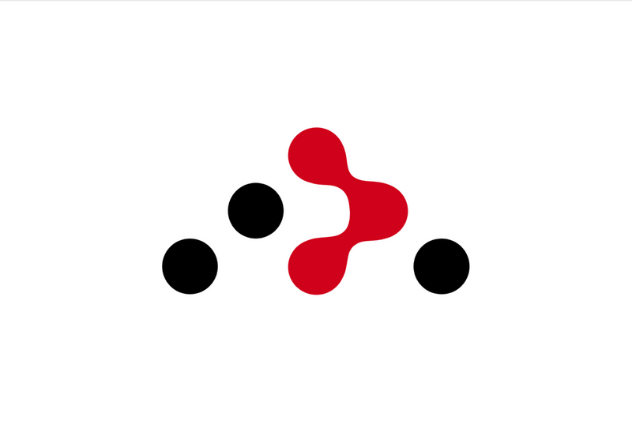
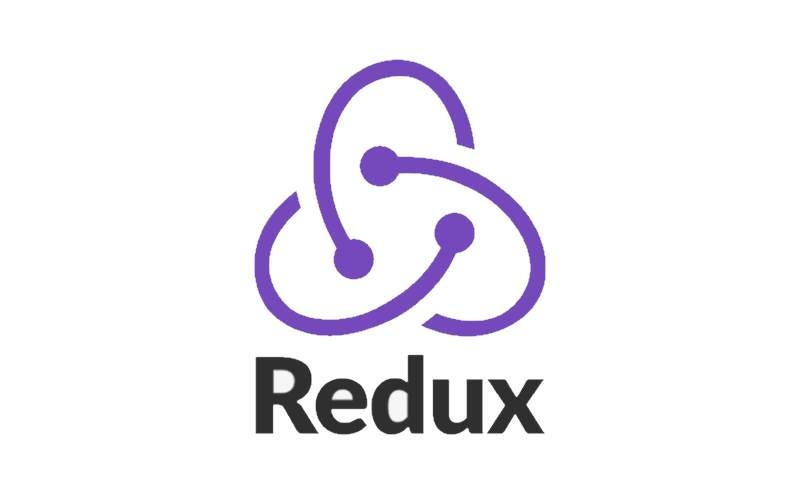
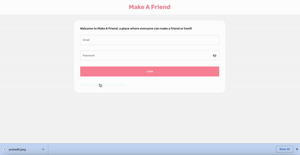
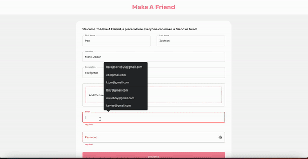
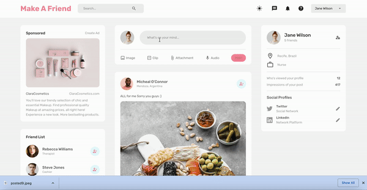
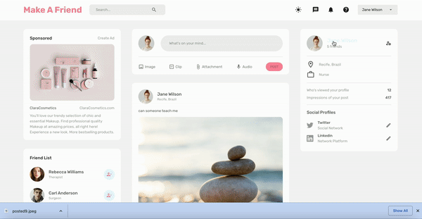

# 👋 Introducing `Make A Friend Repo`

## Table of Contents
* [Description](#Description)
* [Features](#Features)
* [Technologies Used](#Technologies-Used)
* [Functionality](#Functionality)

___

## Description
A full stack social media website, where everyone can make a friend.

[Return to Table of Contents](#Table-of-Contents)

___

## Features
* Can login/register
* Once logged in Users can like/dislike posts
* As a User you too have the ability to make your own post and attach an image as well
* You are able to follow and unfollow whoever you'd like
* Users can comment on others posts as well as go back and delete their comments
* Clicking a users name you can visit their profile and see all their posts
* For a comfortable user experience can toggle on or off the light vs dark mode
* Scalable so all users may use on whichever device they'd like

[Return to Table of Contents](#Table-of-Contents)

___

## Technologies Used
* React 

* React Router 

* VSCode 

* Formik 

* CSS 

* Redux toolkit 

* Redux with Persistent 

* Redux Dropzone 

* Node.js 

* Express.js 

* MongoDb 

* JWT (Json Web Token) 

* Mongoose

* Multer 

* Yup 

[Return to Table of Contents](#Table-of-Contents)

___

## Functionality
You first Log in or make an account 

 

Register page with complete validations and the added functionality of being able to upload a user image 

You can add your own comments to whose ever post you'd like

  

You can like and dislike other users posts as well as follow or unfollow users

You can make your own posts

You can toggle on or off the light vs dark mode

[Return to Table of Contents](#Table-of-Contents)

___

Instructions: 

To install dependencies - "npm install" in both the client and server

[Return to Table of Contents](#Table-of-Contents)